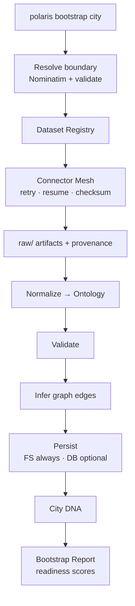

```mermaid
flowchart TB
  CLI["polaris bootstrap city"] --> B["Resolve boundary\nNominatim + validate"]
  B --> R["Dataset Registry"]
  R --> C["Connector Mesh\nretry · resume · checksum"]
  C --> RAW["raw/ artifacts + provenance"]
  RAW --> N["Normalize → Ontology"]
  N --> V["Validate"]
  V --> G["Infer graph edges"]
  G --> S["Persist\nFS always · DB optional"]
  S --> DNA["City DNA"]
  DNA --> REP["Bootstrap Report\nreadiness scores"]
```
